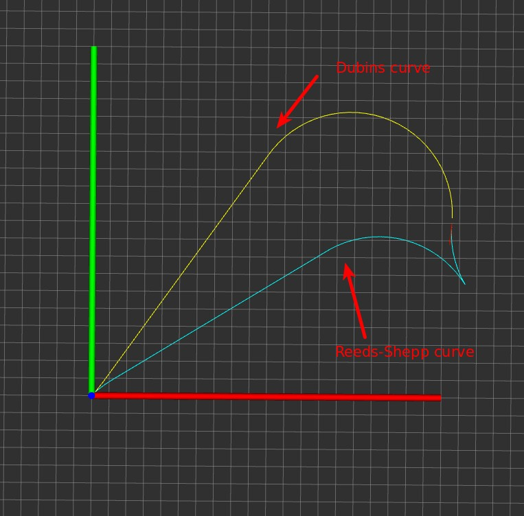

# car_geometric_planner
Use Reeds-Shepp and Dubin curves for path generation for car model  
**Reference list**  
* [pyReedsShepp repo](https://github.com/ghliu/pyReedsShepp)
* [Dubins-Curves repo](https://github.com/AndrewWalker/Dubins-Curves)
* [OMPL code](http://ompl.kavrakilab.org/2012/03/18/geometric-planning-for-car-like-vehicles.html)  

**Results**  

**Reference paper**
- Shkel A M , Lumelsky V . Classification of the Dubins set[J]. Robotics & Autonomous Systems, 2001, 34(4):179-202.
- Reeds J A , Shepp L A . Optimal paths for a car that goes both forwards and backwards[J]. Pacific Journal of Mathematics, 1990, 145(2):367-393.

